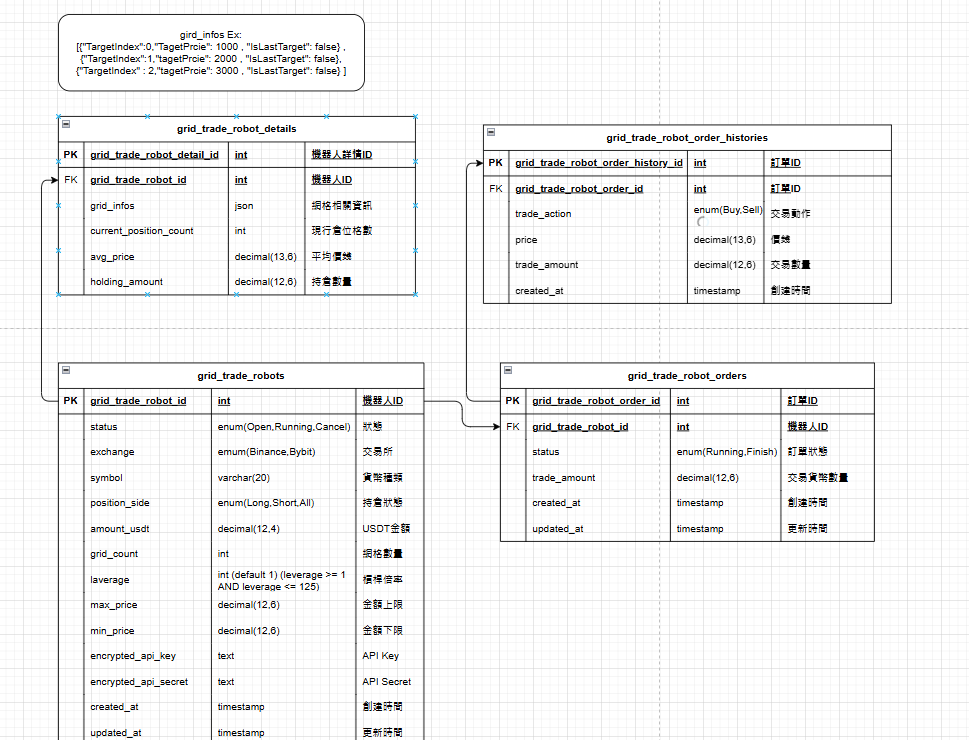

# Database Schema

[點擊查看資料庫結構圖](https://drive.google.com/file/d/1LHCKwMRXESlKlj9vBS7O2z9XtvmNZpa9/view?usp=sharing)

以下是目前的資料庫結構圖：

DB First 指令 :
Scaffold-DbContext "server=127.0.0.1;port=3306;database=crypto_platform;user=root;password=" Pomelo.EntityFrameworkCore.MySql -o ./Models/Context -f -Context "CryptoPlatformDbContext" -NoOnConfiguring

# SQL 文件說明

## 更新紀錄
- **更新日期**：2025-01-15
- **描述**：
  - 修改 `grid_trade_robots` 表的欄位 `leverage`。
  - 將欄位結構調整為 `int` 欄位名稱改為 `laverage`。

- **影響範圍**：
  - 此變更影響 API 端與資料處理邏輯，可能需要檢查後端程式是否正確處理新結構。

## 文件清單
- **Migrations**：
  - `migrations/20250114.sql`：執行 ALTER TABLE 操作。
- **Schema**：
  - 完整DB Schema 可直接 mysql Import。

